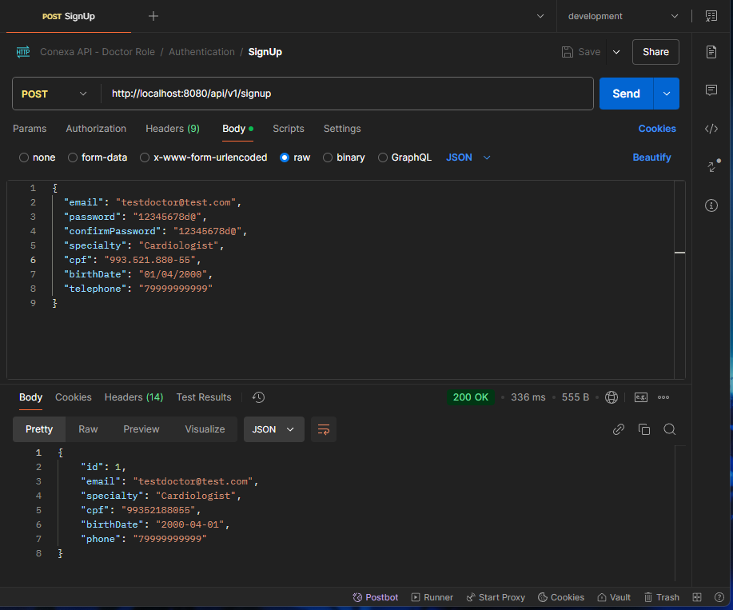
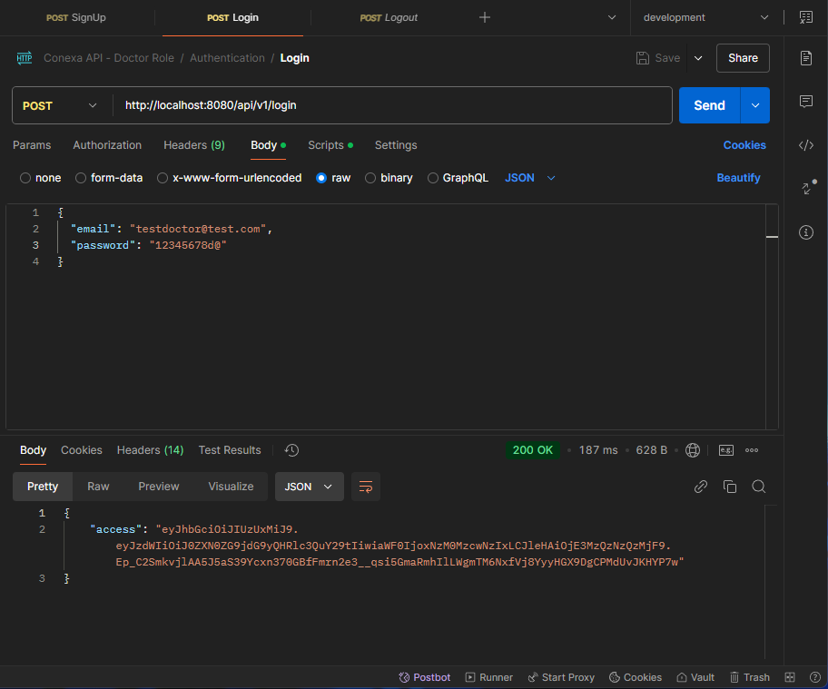
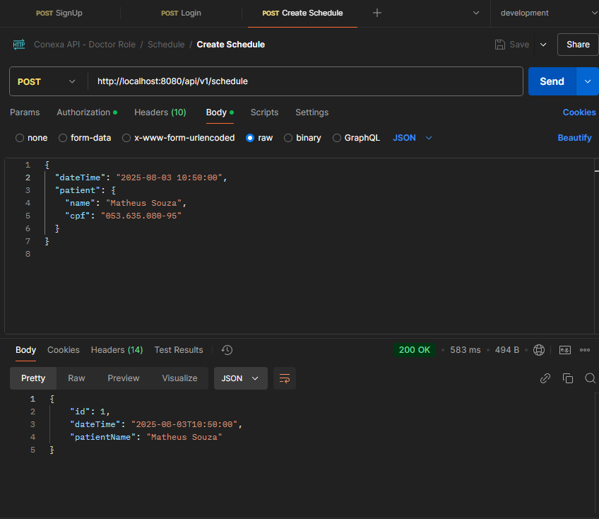
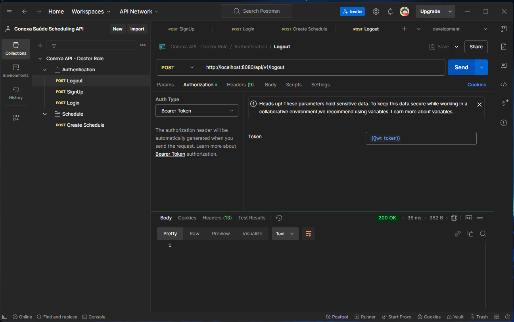
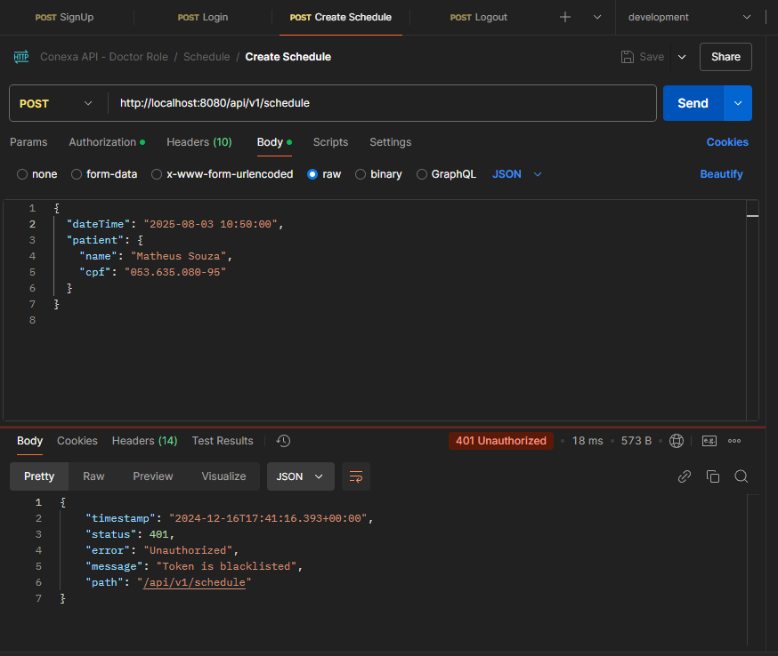

# Conexa Scheduling API

## Description

This API was created to allow doctors to schedule appointments with their patients.

## Technologies and Libraries

- Java 21
- Spring Boot 3.4.0
- MySQL 8.0.28
- Docker (Optional)
- Redis
- Swagger
- JWT

## Architecture

This project was builted following DDD's best practices along with a Clean Architecture, where we have the following layers:
- Application: This layer is responsible for the application's business rules.
- Domain: This layer is responsible for the domain's business rules.
- Infrastructure: This layer is responsible for the communication with external services, such as databases, cache, etc.+
- Presentation: This layer is responsible for the communication with the external world, such as APIs, Web, etc.

Also, this project uses JWT Tokens for authenticating request through the API in the headers as a Bearer Token.
It also uses Redis as a cache to store and blacklist tokens for the rest of the duration of the token.

## How to run
You can run the project both locally and using Docker. I recommend using Docker, as it is easier to set up and run and you will not
have to install MySQL and Redis on your machine. 

Alternatively, you can run the project locally while pointing to a MySQL and Redis instance running on Docker.

Either way, remember to set the environment variables (.env file) that will be used by the application.properties and if you choose to go with Docker, set .env.docker as well.
This step is very important, as application.properties doesn't have a fallback and will not work without the environment variables.

Having said that, let's move on to the steps to run the project.

### Running locally

1. Clone the repository at:
```bash
git clone https://github.com/itsmevicot/conexa-scheduling.git
```
2. Go to the project's root folder:
```bash
cd conexa-scheduling
```
3. If running locally, do:
```bash
mvn clean install
```

4. Finally:
```bash
mvn spring-boot:run
```

or you can run using the IDE of your choice.

### Running with Docker
After cloning the project and going to the project's root folder, run the following commands:

1. Build the project:
```bash
docker-compose up -d --build
```

2. Done. The project is now running on Docker.

## Documentation

You can access the documentation of the API by accessing the following URL:
```bash
http://localhost:8080/swagger-ui.html
```

Also, this project has an API Collection available to be imported into Postman. You can find it at the root folder of the project.
If you choose to use the Collection, you can set up an Environment called "jwt_token" to automatically set the token in the headers of the requests.

## Tests
Both in Docker or locally, you can run the tests by running the following command (in the project's root folder):
```bash
mvn test
```

## Functionalities and Showcasing

The API has the following functionalities:
- Register a new doctor
- Login as a doctor
- Logout as a doctor
- Create a schedule as a logged-in doctor
- Create a patient as a logged-in doctor (when creating a schedule or independently)

1. Registering a new doctor:



2. Logging in as a doctor:


3. Creating a schedule as a logged-in doctor:


4. Logout as a doctor (empty body, just the token in the header):


5. Trying to create a schedule with blacklisted token:


The API has a lot more of validations. Here's a summary of the main ones:

# SignUp
- Must have a valid and unique email
- Must have a strong password (between 8 to 16 digits, at least one number and one special character)
- Must have a specialty
- Must have a valid and unique CPF number
- Must be at least 18 years old
- Must have a valid brazilian telephone number (between 10 and 11 digits)

# Login
- Must have been registered
- Must provide the correct email and password

# Create Schedule
- Must be logged in
- Must provide a future date
- Must provide a valid CPF for the patient
- The patient and the doctor can't have a schedule in a 20 minutes interval (for more or less) at the schedule appointed time
- Patient will be created as an entity to allow the doctor to update his name and considering expanding the functionalities in the future

# Logout
- Must provide a valid JWT token in the header
- Must provide a not blacklisted token